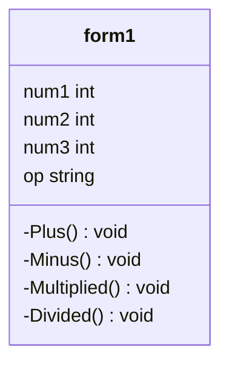

# Project--643450334-3
ความเป็นมาของโปรแกรม
```
โปรแกรมเครื่องคิดเลข และคิดคำนวณเลขของของตนเอง สร้างขึ้นเพื่อต้องการที่จะทราบว่าจะคำนวณเลขพื้นฐานในชีวิตประจำวันยังไง ให้รวดเร็ว 
```
วัตถุประสงค์ของโปรแกรม
```
1.เพื่อช่วยให้ตนเองคำนวณ หรือคิดเลขได้อย่างรวดเร็ว แสดงค่าจำนวณ บวก ลบ คูณ หาร ได้อย่างถูกต้องแม่นยำ
2.เพื่อที่จะสามารถช่วยให้เราคล่องเรื่องการคิดเลข และสะดวกรวดเร็วมากขึ้น
```

Class Diagram

ผู้พัฒนาโปรแกรม
```
นางสาวอฆพร ไร่ขาม รหัสนักศึกษา 643450334-3
```
